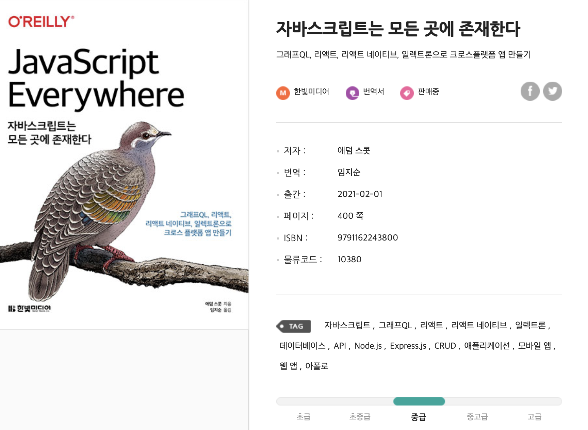

### [책 리뷰] 자바스크립트는 모든 곳에 존재한다.

한빛미디어 책 리뷰어에 선정되어 처음으로 제공받은 책이다.

책 제목으로만 봐서는 자바스크립트의 개념적인 부분을 실생활과 엮어서 이론적으로 알려줄 것 같은 책이었지만 목차를 확인해보니 이론적인 부분보다는 실무적인 부분이 더 많아보였는데 **실제로 실무 부분을 중점으로 둔 책이다**.

해당 책은 초반에 노드와 익스프레스로 웹 어플리케이션을 만들어 나가면서 graphQL을 공부한다. 뒤쪽에서는 리액트나 일렉트론을 사용하기도 하고 리액트 네이티브를 사용하여 모바일 앱 배포까지 하는 과정으로 이루어진다.

실제 난이도는 중급이라고 표기되어 있는데, 어느정도 맞는것 같다. **자바스크립트나 기본적인 웹 로직을 알고 있다는 가정하에 풀어 나가는 책**이다. 나름대로 개념 설명을 차근차근 해주지만 자바스크립트 자체에 대한 개념적인 부분보다는 자바스크립트의 여러 라이브러리나 프레임워크 사용 가이드를 알려주면서 왜 사용하는지에 대한 설명이 많다.

개인적으로 본인은 리액트 hooks까지 기존에 사용을 해보았기 때문에 술술 읽혔다. 그리고 뭔가 줄줄 설명하는 느낌이 아니라 핵심만 콕콕 찝어주는 문단이 많다. **개인적으로 각각에 대한 주제를 넓고 얕게 어떤것인지에 대해 맛만 보여주고 넘어가기 때문에 해당 책을 본 후에 관심이 생긴 프레임워크나 라이브러리 책을 새로 사서 깊게 보면 될 것 같다.** 개인적으로 이것저것 마트에서 시식하듯이 살짝살짝 맛보여주는게 괜찮았다..ㅋㅋㅋㅋ 대신 이미 실무에서 어느정도 구르고 있는 프론트개발자라면 난이도가 많이 쉬울것이다.

자바스크립트를 공부하고 나서 자바스크립트에 관련된 기술스택이 어떤것이 있는지 고민하는 초급분들께 추천드린다. 자바스크립트 개념책을 다 읽어 기본적인 이론을 다 깨우쳤다면, 해당 책으로 여러 프레임워크나 라이브러리를 살짝살짝 맛본 후에 조금 파보고싶다 하는 부분의 책을 사거나 자료를 찾아보는게 Best인듯.

`별점` : ⭐️⭐️⭐️⭐️

`한줄평` : 자바스크립트 프레임워크/라이브러리를 한입씩 맛보는 시식 코너 같은 책

`이런분께 추천` :  
1. 자바스크립트 개념공부를 막 끝내고 어떤 프레임워크를 공부할까 고민하고있는 사람.
2. 기존 JQuery나 레거시한 프론트 기술스택을 사용하고 있는데 요새 쓰는 기술 살짝 맛보고 싶은 사람.

- - -
#### [책 링크]

[자바스크립트는 모든 곳에 존재한다 - 애덤 스콧 (한빛미디어)](https://www.hanbit.co.kr/store/books/look.php?p_code=B5225420272)